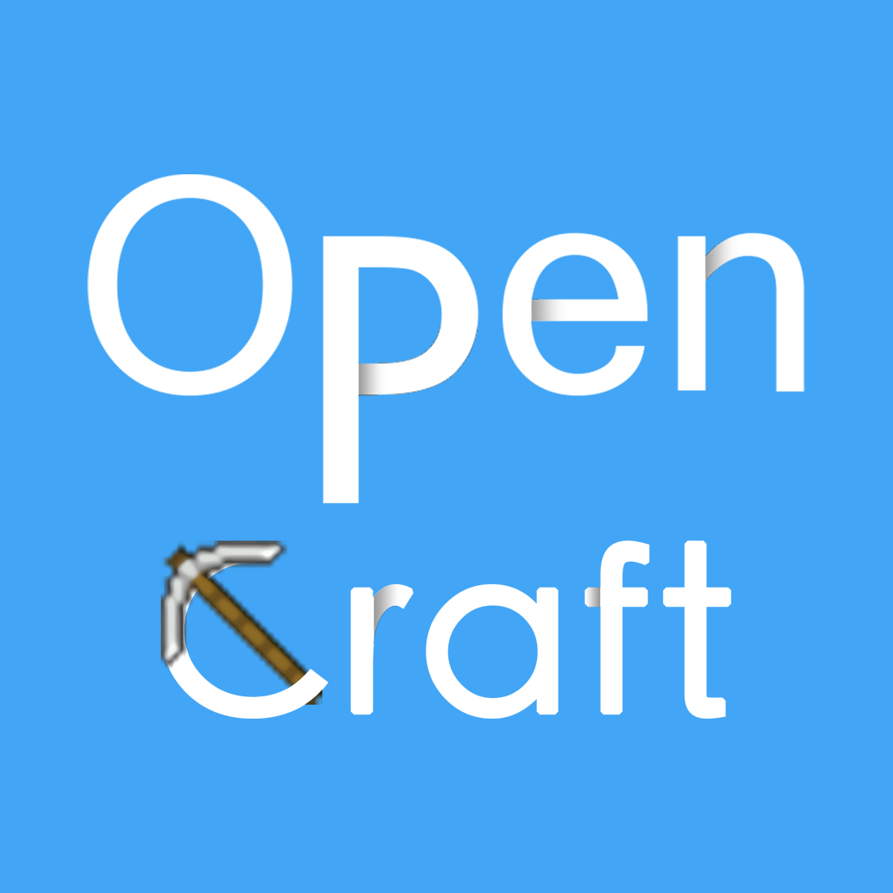

# OpenCraft

A Minecraft server with homemade plugins using Kotlin.

# Getting Started

Build and maintain this project with Jetbrains IDEA.

Debug it with Docker.

- Gradle Sync
- Gradle task: `download` to upgrade Paper, the server backend
- Gradle task: `copyJar` to build and make all plugins in place
- Run: `cd ./server && docker-compose up` to see the bullshit